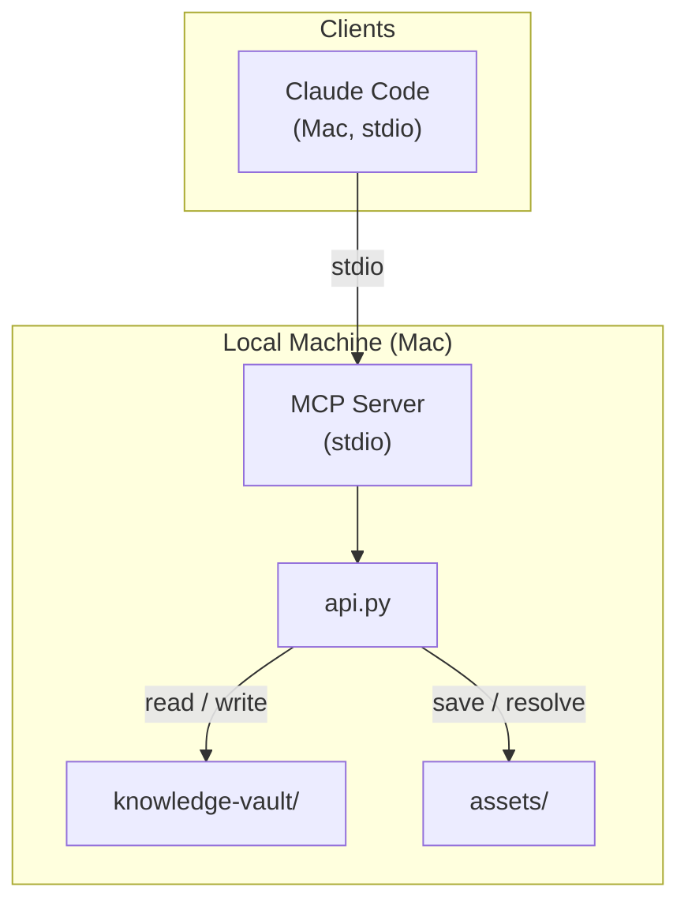

# Loci Architecture Diagrams

---

## 1. High-Level Capture Flow

```mermaid
flowchart TD
    subgraph Clients
        CC["Claude Code\n(Mac, stdio)"]
    end

    subgraph Local["Local Machine (Mac)"]
        MCP_L["MCP Server\n(stdio)"]
        API_L["api.py"]
        V_L["knowledge-vault/"]
        A_L["assets/"]
    end

    CC -->|"stdio"| MCP_L
    MCP_L --> API_L
    API_L -->|"read / write"| V_L
    API_L -->|"save / resolve"| A_L
```
